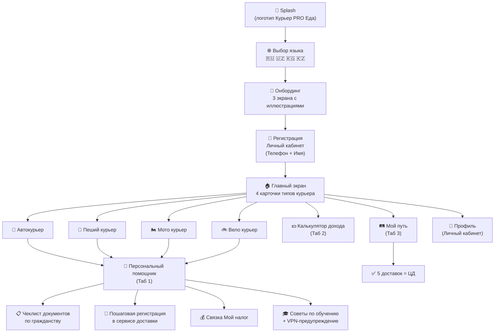
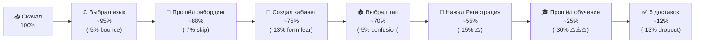

# 🗺️ Курьер PRO Еда — Архитектура и Пользовательский Путь
### User Journey · Screen Map · Funnel Architecture · v2.0

---

## Ключевая метрика

> **Цель:** Довести кандидата от скачивания приложения до **5 выполненных доставок (ЦД)**
> **Текущая конверсия:** 1.8% (19 из 1083 лидов)
> **Целевая:** 8–12% (через снижение отвала на каждом этапе)

---

## Карта экранов (Screen Map)



---

## Фаза 0. Splash (0.8 сек)

| Элемент | Спецификация |
|---------|-------------|
| Фон | `#FCE000` (бренд-жёлтый) |
| Логотип | «Курьер PRO Еда» по центру, белый текст или тёмный |
| Анимация | Fade-in 300ms → задержка 500ms → fade-out в выбор языка |
| Назначение | Брендинг + инициализация сервисов |

---

## Фаза 1. Выбор языка (5 секунд)

**Минимальный экран, без лишнего.**

```
┌──────────────────────────┐
│                          │
│    Курьер PRO Еда        │  ← headingXL (28px, w700)
│                          │
│    Выберите язык          │  ← headingM (18px, w600)
│    Tilni tanlang          │  ← bodyM (14px, w400, #9E9B98)
│                          │
│  ┌──────┐  ┌──────┐      │
│  │ 🇷🇺   │  │ 🇺🇿   │      │  ← 4 карточки 2×2
│  │Русский│  │O'zbek│      │     r=16, bg=#F6F5F3
│  └──────┘  └──────┘      │     h=72, shadow.none
│  ┌──────┐  ┌──────┐      │     active: border 2px #FCE000
│  │ 🇰🇬   │  │ 🇰🇿   │      │
│  │Кыргыз │  │Қазақ │      │
│  └──────┘  └──────┘      │
│                          │
└──────────────────────────┘
```

> [!NOTE]
> Язык определяет **только язык интерфейса**, НЕ страну работы и НЕ гражданство. Узбек может работать в Москве — это разные параметры (выбираются позже в профиле).

---

## Фаза 2. Онбординг (3 экрана, ~15 секунд)

### Экран 1/3 — «Зарабатывай доставляя»

```
┌──────────────────────────┐
│                          │
│   ┌──────────────────┐   │
│   │                  │   │
│   │   [ИЛЛЮСТРАЦИЯ]  │   │  ← Курьер на велосипеде
│   │   Стиль: flat,   │   │     с жёлтым термокоробом
│   │   тёплые цвета,  │   │     на фоне городского
│   │   минимализм     │   │     силуэта
│   │                  │   │
│   └──────────────────┘   │
│                          │
│   Зарабатывай             │  ← headingXL (28px, w700)
│   доставляя еду           │
│                          │
│   от 85 000 ₽ в месяц    │  ← bodyL (16px, w400, #6D6B69)
│   Гибкий график.          │
│   Выходи на смену         │
│   когда удобно.           │
│                          │
│   ● ○ ○          Далее →  │  ← dots + CTA
│                          │
└──────────────────────────┘
```

**Тексты на 4 языках:**

| Язык | Заголовок | Подзаголовок |
|------|----------|-------------|
| 🇷🇺 RU | Зарабатывай доставляя еду | от 85 000 ₽ в месяц. Гибкий график. Выходи на смену когда удобно. |
| 🇺🇿 UZ | Yetkazib berish orqali pul ishlang | oyiga 85 000 ₽ dan. Qulay jadval. Qachon qulay bo'lsa, ishlang. |
| 🇰🇬 KG | Тамак жеткирип акча тап | айына 85 000 ₽ дан. Ыңгайлуу график. |
| 🇰🇿 KZ | Тамақ жеткізіп ақша табыңыз | айына 85 000 ₸ ден. Икемді кесте. |

---

### Экран 2/3 — «Мы проведём шаг за шагом»

```
┌──────────────────────────┐
│                          │
│   ┌──────────────────┐   │
│   │                  │   │
│   │   [ИЛЛЮСТРАЦИЯ]  │   │  ← Рука с телефоном,
│   │   Чеклист на     │   │     на экране чеклист
│   │   экране         │   │     с галочками ✓ ✓ ✓
│   │                  │   │
│   └──────────────────┘   │
│                          │
│   Проведём тебя           │  ← headingXL (28px, w700)
│   от А до Я               │
│                          │
│   Поможем собрать          │  ← bodyL (16px, w400, #6D6B69)
│   документы, пройти        │
│   регистрацию и выйти      │
│   на первую смену.         │
│                          │
│   ○ ● ○          Далее →  │
│                          │
└──────────────────────────┘
```

---

### Экран 3/3 — «Персональный помощник 24/7»

```
┌──────────────────────────┐
│                          │
│   ┌──────────────────┐   │
│   │                  │   │
│   │   [ИЛЛЮСТРАЦИЯ]  │   │  ← Чат-пузырь с
│   │   AI-аватар с    │   │     аватаркой помощника
│   │   пузырём        │   │     и ответом на вопрос
│   │   диалога        │   │
│   │                  │   │
│   └──────────────────┘   │
│                          │
│   Помощник ответит        │  ← headingXL (28px, w700)
│   на любой вопрос         │
│                          │
│   Какие документы нужны?   │  ← bodyL (16px, w400, #6D6B69)
│   Как пройти обучение?     │
│   Что делать если ошибка?  │
│   — спроси помощника.      │
│                          │
│   ○ ○ ●       Начать →    │  ← ЖЁЛТАЯ pill-кнопка
│                          │
└──────────────────────────┘
```

> [!TIP]
> **Кнопка «Далее» на 1-2 экранах** — ghost-стиль (текст + стрелка, без фона). **Кнопка «Начать» на 3-м экране** — полноценная CTA pill `#FCE000`. Это создаёт нарастание: от просмотра → к действию.

---

## Фаза 3. Регистрация Личного Кабинета

**Минимум полей — максимум конверсии.**

```
┌──────────────────────────┐
│  ←                       │
│                          │
│   Личный кабинет          │  ← headingXL (28px, w700)
│                          │
│   ─── Телефон ─────────   │  ← overline label (11px, #9E9B98)
│   🇷🇺 +7  9XX XXX XX XX  │  ← formField (17px, w400)
│   ─────────────────────   │     Флаг авто из системной
│                          │     локали телефона
│   ─── Имя ─────────────   │
│   Александр               │  ← formField (17px, w400)
│   ─────────────────────   │
│                          │
│                          │
│                          │
│  ┌──────────────────────┐ │
│  │      Продолжить      │ │  ← ctaButton (h=52, pill,
│  │                      │ │     #FCE000, text #21201F)
│  └──────────────────────┘ │
│                          │
│  Нажимая «Продолжить»,   │  ← caption (12px, #9E9B98)
│  вы принимаете условия    │     + подчёркнутая ссылка
│  использования            │
│                          │
└──────────────────────────┘
```

**Логика префикса телефона:**

| Префикс | Флаг | Код | Определяет |
|---------|------|-----|-----------|
| +7 | 🇷🇺 | `ru` | Только язык ввода по умолчанию |
| +998 | 🇺🇿 | `uz` | Только язык |
| +996 | 🇰🇬 | `kg` | Только язык |
| +7 (7XX) | 🇰🇿 | `kz` | Только язык |
| +375 | 🇧🇾 | `by` | Только язык |

> [!IMPORTANT]
> **Страна работы определяется ОТДЕЛЬНО — на следующем экране или в профиле.** Узбек с номером +998 может работать курьером в Москве. Префикс НЕ определяет реферальную ссылку!

---

## Фаза 4. Главный экран (Main Screen)

### Структура: 3 таба + профиль

```
┌──────────────────────────────────────┐
│  Курьер PRO Еда            👤       │  ← AppBar: headingM (18, w600)
│                            profile  │     + аватар-кнопка справа
├──────────────────────────────────────┤
│                                      │
│  Привет, Александр! 👋               │  ← headingL (22px, w700)
│  Выберите направление                │  ← bodyM (14px, #6D6B69)
│                                      │
│  ┌──────────┐  ┌──────────┐          │
│  │  🚗      │  │  🚶      │          │  ← 4 карточки 2×2
│  │          │  │          │          │     в стиле serviceCard
│  │Автокурьер│  │ Пеший    │          │     r=16, bg=#F6F5F3
│  │          │  │ курьер   │          │     padding=16
│  │от 3500₽  │  │от 2500₽  │          │     иконка 44×44 r=12
│  │  /день   │  │  /день   │          │
│  └──────────┘  └──────────┘          │
│  ┌──────────┐  ┌──────────┐          │
│  │  🏍️      │  │  🚲      │          │
│  │          │  │          │          │
│  │  Мото    │  │  Вело    │          │
│  │ курьер   │  │ курьер   │          │
│  │от 3000₽  │  │от 2800₽  │          │
│  │  /день   │  │  /день   │          │
│  └──────────┘  └──────────┘          │
│                                      │
│  ┌──────────────────────────────┐    │
│  │ 💬 Персональный помощник     │    │  ← chatAssistantRow
│  │    Задайте любой вопрос   >  │    │     r=16, bg=#F6F5F3
│  └──────────────────────────────┘    │     аватар 32px #FCE000
│                                      │
├──────────────────────────────────────┤
│  🏠 Главная   💵 Доход   🛤️ Мой путь │  ← bottomNavBar
│   ●                                  │     active: #21201F
└──────────────────────────────────────┘     inactive: #9E9B98
```

**При нажатии на карточку курьера:**
→ Открывается **Персональный помощник** (Таб 1) с предустановленным контекстом выбранного типа. Например, нажал «Автокурьер» → помощник сразу говорит:
> *«Отлично! Для работы автокурьером тебе понадобятся: водительские права кат. B, свидетельство о регистрации ТС и полис ОСАГО. Давай проверим документы по списку?»*

---

## Фаза 5. Табы

### Таб 1 — 💬 Персональный помощник

**Не «AI-куратор», а именно «Персональный помощник для регистрации».**

Функции:
- Ответы на вопросы по документам (по гражданству)
- Пошаговая навигация по регистрации
- Отработка возражений («А штрафы есть?», «Нужна ли медкнижка?»)
- Инструкция по привязке «Мой налог»
- Предупреждение про VPN
- **Action Card** с кнопкой перехода на регистрацию (реферальная ссылка по стране РАБОТЫ)

### Таб 2 — 💵 Калькулятор дохода

- Выбор типа транспорта (из 4 выбранных)
- Слайдеры: дней в неделю, часов в день
- Динамическая сумма (анимация счётчика)
- Карточки целей (iPhone 16 за X смен, Самокат за Y смен)

### Таб 3 — 🛤️ Мой путь

- 5 шагов чеклист с toggle-переключателями:
  1. ✅ Установить приложение (уже выполнено)
  2. ◻️ Зарегистрироваться в сервисе доставки
  3. ◻️ Привязать «Мой налог»
  4. ◻️ Пройти онлайн-обучение
  5. ◻️ Выполнить 5 доставок
- Прогресс-бар сверху (1/5, 2/5... 5/5)
- Плашка-предупреждение: «Выключите VPN при прохождении обучения»

---

## Профиль (Личный кабинет)

Доступен по нажатию на 👤 в правом верхнем углу **с любого экрана**.

```
┌──────────────────────────┐
│                    ✕     │  ← модальный bottomSheet r=24
│                          │
│  👤 Александр             │  ← headingL (22px, w700)
│  +7 9XX XXX XX XX        │  ← bodyM (14px, #6D6B69)
│                          │
│  ─── Страна работы ────  │
│  🇷🇺 Россия            > │  ← formField + chevron
│  ─────────────────────── │
│                          │
│  ─── Язык ────────────── │
│  🇷🇺 Русский           > │  ← formField + chevron
│  ─────────────────────── │
│                          │
│  ─── Тип курьера ─────── │
│  🚶 Пеший курьер       > │  ← formField + chevron
│  ─────────────────────── │
│                          │
│                          │
│  🗑️ Удалить аккаунт      │  ← bodyM (14px, #F5222D)
│     и все данные          │     Apple Guideline 5.1.1(v)
│                          │
└──────────────────────────┘
```

> [!IMPORTANT]
> **«Страна работы»** — это КЛЮЧЕВОЕ поле. Именно оно определяет, какую реферальную ссылку (`refRU`, `refKZ`, `refUZ`, `refKG`) покажет помощник. Не телефон, не язык, а именно страна работы.

---

## Воронка и точки отвала



### Наши «пуш-перехваты» по точкам отвала:

| Время | Пуш-уведомление | Цель |
|-------|-----------------|------|
| +30 мин | «Выключи VPN перед обучением — без этого тест не загрузится» | Спасти 30% на обучении |
| +3 часа | «Не забудь привязать Мой налог — без этого не получишь оплату» | Предотвратить блокировку |
| +24 часа | «Александр, помощник готов помочь с регистрацией. Остался 1 шаг!» | Вернуть ушедших |
| +3 дня | «Курьеры в твоём городе уже зарабатывают. Выходи на первую смену!» | Мотивация |
| +5 дней | «Осталось 5 доставок до бонуса. Помощник подскажет лучшее время!» | Финальный толчок |

---

## Отличия от текущей v4.0.0

| Было (v4.0.0) | Стало (v5.0) |
|--------------|-------------|
| «AI-Куратор» | **«Персональный помощник»** |
| Приветствие с 3 карточками преимуществ | **Полноценный 3-экранный онбординг с иллюстрациями** |
| Выбор языка на Welcome screen | **Отдельный экран выбора языка (Фаза 1)** |
| Нет выбора типа курьера | **4 карточки: Авто / Пеший / Мото / Вело** |
| Профиль в модальном диалоге | **Личный кабинет — первый экран при входе + иконка 👤** |
| Заголовок «ЕдаGO» | **«Курьер PRO Еда» везде** |
| Город определяется автоматически | **Страна работы выбирается вручную в профиле** |
| Табы: Куратор / Доход / Мой путь | **Табы: Главная / Доход / Мой путь** |

---

## Навигационная структура (финал)

```
App Launch
├── Splash (0.8s)
├── Language Picker (если первый запуск)
├── Onboarding ×3 (если первый запуск)
├── Registration (если нет кабинета)
│
└── MainScreen (BottomNavBar)
    ├── Tab 1: 🏠 Главная
    │   ├── Приветствие + 4 карточки типов
    │   ├── Сниппет «Персональный помощник»
    │   └── → При нажатии на карточку → Чат помощника
    │
    ├── Tab 2: 💵 Доход
    │   └── Калькулятор + цели
    │
    ├── Tab 3: 🛤️ Мой путь
    │   └── 5-шаговый чеклист + прогресс
    │
    └── 👤 Профиль (модальный, из AppBar)
        ├── Имя, Телефон
        ├── Страна работы
        ├── Язык
        ├── Тип курьера
        └── 🗑️ Удалить аккаунт
```
