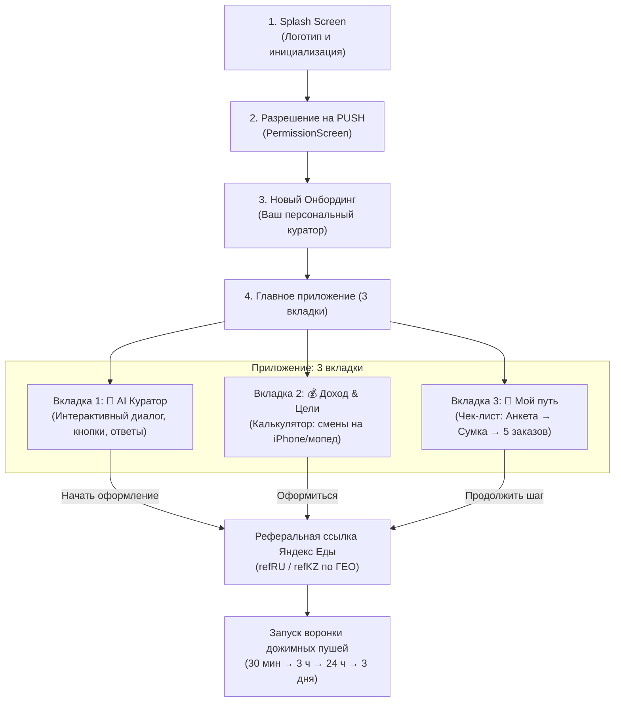

# План перехода на версию v4.0.0: «AI Помощник» 🚀

## Описание цели
Трансформация приложения из одноразовой витрины-ссылки в полноценного персонального цифрового наставника **«AI Помощник курьера Яндекс Еды»** (версия `4.0.0+26`).

**Главная бизнес-цель:** Максимизировать не просто клики, а **доведение кандидатов до Целевого Действия (ЦД) — 5 выполненных заказов**, за которые партнёр получает от 1 000 до 2 500 ₽ за человека.

---

## Что требует подтверждения пользователя (User Review Required)

> [!IMPORTANT]
> 1. **Старый публичный чат и старый FAQ удаляются из интерфейса.** Вместо них ставится персональный AI-Куратор (пользователь общается тет-а-тет с ботом, а не пишет в общую ленту «привет»).
> 2. **Package Name НЕ меняется:** остаётся строго `fast.courier.job` (подтверждённый ключ в Google Play и RuStore).
> 3. **Рубильники модерации (Firebase) сохраняются:** проверочный квиз для модераторов остаётся рабочим, боевой режим для курьеров открывает нового AI-Помощника.
> 4. **GigaChat Lite API:** Для свободного ввода текста будет реализован сервис GigaChat с **локальным fallback-движком** (если ключа нет или пропал интернет, бот мгновенно отвечает по зашитой базе знаний Яндекса без ошибок).

---

## Архитектура переходов и экранов

---

## План изменений по компонентам

### 1. Конфигурация и версия
#### `[MODIFY] pubspec.yaml`
- Повышение версии до `4.0.0+26`.
- Добавление `http` (для запросов к GigaChat API, если ещё нет).

---

### 2. Новый экран онбординга (Вход)
#### `[NEW] lib/screens/onboarding/welcome_curator_screen.dart`
- Полное соответствие экрану 1 из утверждённого светлого макета:
  - Заголовок: *«Ваш персональный куратор Яндекс Еды»*.
  - 3 парящие белые карточки с мягкой тенью:
    1. 🤖 **AI-помощник 24/7** (*«Ответит на любые вопросы»*)
    2. 💳 **Выплаты каждый день** (*«На карту любого банка»*)
    3. 🎒 **Бесплатная экипировка** (*«Термокороб и форма без залога»*)
  - Кнопка во всю ширину: `[ Подобрать условия и начать → ]` (фирменный жёлтый `#FCE000`).

---

### 3. Главный каркас на 3 вкладки
#### `[MODIFY] lib/screens/main_screen.dart`
- Замена 4 старых вкладок на **3 новые**:
  1. `CuratorTab` (Куратор) — иконка робота/ассистента.
  2. `IncomeCalculatorTab` (Доход) — иконка калькулятора.
  3. `RoadmapTab` (Мой путь) — иконка трекера/дорожной карты.
- Нижний бар: белый фон, графитовые иконки, индикатор активной вкладки с жёлтым акцентом.

---

### 4. Вкладка 1: «AI Куратор» (Интерактивный наставник)
#### `[NEW] lib/screens/curator/curator_tab.dart`
- Интерфейс мессенджера один-в-один с экраном 2:
  - Белые облачка сообщений куратора с мягкой тенью.
  - Жёлтые облачка ответов кандидата.
  - Быстрые интерактивные чипсы-кнопки:
    - `[ 🚶 Пешком ]` `[ 🚲 На велосипеде ]` `[ 🚗 На авто ]`
    - `[ 🚀 Сразу к регистрации ]`
  - Поле ввода снизу для ручных вопросов.
- **Интеллектуальный движок:**
  - Логика подбора условий по городам (Москва/СПб, Казань, Владивосток, Екб и др.).
  - Проверка онлайн/офлайн оформления (адреса курьерских центров).
  - Выдача правильной ссылки из Firestore (`refRU`, `refKZ`...).

#### `[NEW] lib/services/curator_ai_service.dart`
- Сервис обработки вопросов курьера:
  - Прошитая база знаний Яндекс Еды (все 9 категорий возражений, документы по гражданствам РФ/ЕАЭС/студенты, правила выплат, отсутствие штрафов за случайные опоздания).
  - Интеграция GigaChat Lite API для ответов на произвольный текст.
  - Мгновенный локальный ответ, если нет связи.

---

### 5. Вкладка 2: «Доход» (Калькулятор целей)
#### `[MODIFY] lib/screens/calculator_tab.dart`
- Обновление под экран 3:
  - Добавление блока **«Цели»**:
    - 📱 *Новый iPhone 16* — шкала прогресса (дни/смены).
    - 🛵 *Электросамокат* — шкала прогресса.
  - Динамическая привязка к ползункам смен.
  - Прямая кнопка *«Начать зарабатывать на цель»* с переходом к регистрации.

---

### 6. Вкладка 3: «Мой путь» (Геймификация до 5 заказов)
#### `[NEW] lib/screens/roadmap/roadmap_tab.dart`
- Экран 4 из утверждённого макета:
  - Прогресс-бар вверху (например, 20% / 40% / 100%).
  - 5 шагов до бонуса:
    1. ✅ **Анкета в Яндекс Про**
    2. 🔵 **Фотоконтроль паспорта** (с советами, как сфотографировать без бликов)
    3. ⬜ **Получить термосумку в КЦ / ПВЗ** (с адресом или онлайн-инструкцией)
    4. ⬜ **Первый заказ** (поддержка на первом слоте)
    5. 🎁 **5 заказов = Разблокировка бонусов и выплат!**
  - Сохранение прогресса локально в `SharedPreferences`.

---

### 7. Система PUSH-дожима (Follow-up Loop)
#### `[MODIFY] lib/services/local_push_service.dart`
- Добавление специальной цепочки при клике на оформление:
  - `+30 мин`: *«Получилось отправить анкету? Если есть вопрос по фотоконтролю — напишите Куратору!»*
  - `+3 часа`: *«Термокороб ждёт вас! Завершите оформление, чтобы забрать форму бесплатно.»*
  - `+24 часа`: *«В вашем районе сейчас повышенный спрос! Первые бонусы уже активны.»*
  - `+3 дня`: *«Как первые доставки? Выполните 5 заказов, чтобы забрать максимальную выплату!»*

---

## План верификации (Verification Plan)

### 1. Автоматическая проверка
- `flutter analyze` — отсутствие ошибок компиляции, типов и сломанных импортов.
- Сборка тестового APK:
  `flutter build apk --release --dart-define=STORE=rustore`

### 2. Ручная проверка UI и логики
- Проверка экрана Онбординга: правильные цвета (`#F5F4F2`, `#FFFFFF`, `#FCE000`), тени, шрифты Manrope.
- Проверка Вкладки 1: нажать на чипсы (`Пешком`, `На авто`), проверить переход к регистрации по ссылке.
- Проверка Вкладки 2: подвигать ползунки калькулятора — шкалы целей должны динамически пересчитываться.
- Проверка Вкладки 3: отображение чек-листа до 5 заказов.
- Проверка 3 вкладок в таб-баре: плавные переходы без мерцаний.
